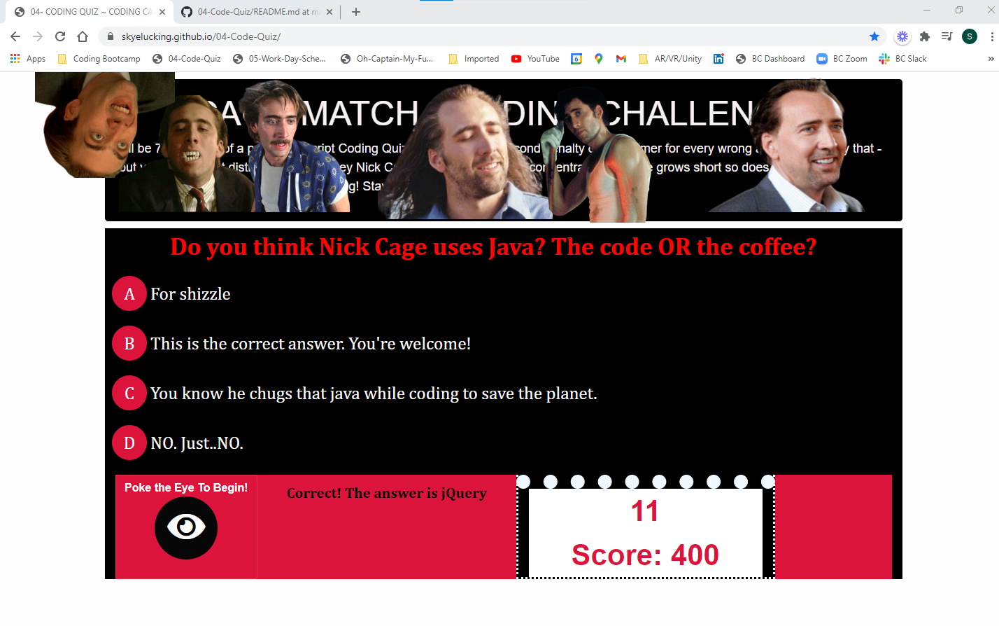

# Skye Lucking - 03 JavaScript Password Generator (Using the Class Example)

<h1>Description of application</h1>
This is a fun "CAGE MATCH - JAVASCRIPT CODE QUIZ" it:
- Instructs the user that they will answer questions, be scored, and lose time if they have an incorrect answer. 
- Adds 100 points to the score for every correct answer
- Decreases the time by 10 seconds for every incorrect answer
- Let's the user know if their answer was correct or incorrect and tells them what the right answer is
- Records their scores in local storage and then passes them to the High Score page after 3 seconds
- When at the High Scores page the user can enter their initials, which goes into local storage and then also clear their scores.
- Also - there's lots of actor Nicola Cage - hence "Cage Match"!

<h1>Screenshot</h1>
 
 
 
 
 
 
 
 
 
 
 

<h1>Link to the deployed application</h1>
<a href="https://skyelucking.github.io/04-Code-Quiz/">https://skyelucking.github.io/04-Code-Quiz/</a>

<h1>Link to GitHub Repo</h1>
<a href="https://github.com/skyelucking/04-Code-Quiz">https://github.com/skyelucking/04-Code-Quiz</a>

Now here is your joke... 
I went to the zoo yesterday and saw a baguette in a cage.
 
 
 
<em>The zookeeper said it was bread in captivity.</em>
